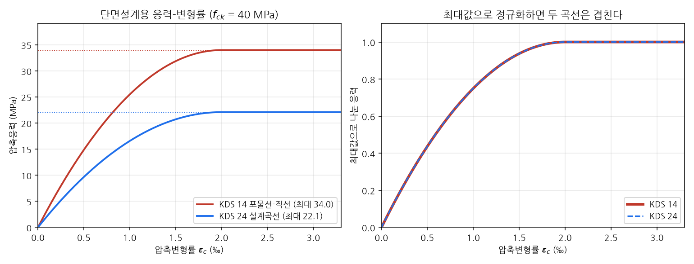
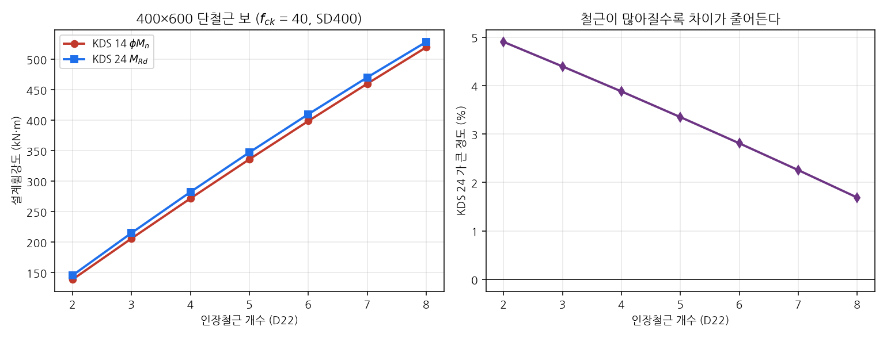
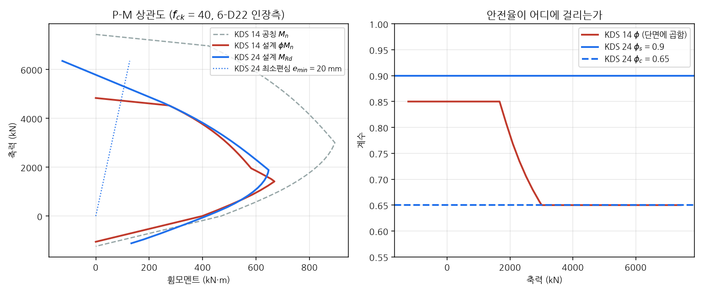
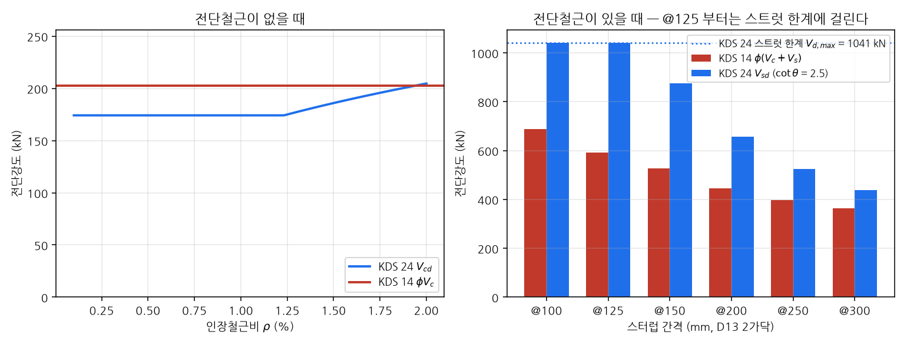

# KDS 14 와 KDS 24 의 비교

이 저장소는 **강도설계법(KDS 14 20)** 과 **한계상태설계법(KDS 24 14 21)** 을 둘 다
다룬다. 같은 단면을 두 기준으로 풀 수 있다는 뜻인데, 두 결과가 왜 다른지를 알고
써야 한다. 이 문서는 그 차이를 한자리에 모은다.

이 문서의 모든 숫자와 그림은 `scripts/build_comparison.py` 가 실제로 계산한
것이다. 다시 만들려면:

```shell
python scripts/build_comparison.py
```

## 한 줄 요약

> **안전율을 거는 자리가 다르다.** KDS 14 는 공칭강도를 다 구한 뒤 단면에
> $\phi$ 를 한 번 곱한다. KDS 24 는 재료마다 재료계수를 곱해 놓고 단면을 푼다.
> 그래서 KDS 24 에는 곱할 $\phi$ 가 없고, 해석 결과가 곧 설계강도다.

```
KDS 14 (강도설계법)          KDS 24 (한계상태설계법)

  f_ck, f_y                    f_ck, f_y
      ↓                            ↓  × 재료계수 (φ_c = 0.65, φ_s = 0.90)
  단면 해석                    f_cd, f_yd
      ↓                            ↓
  공칭강도 M_n                 단면 해석
      ↓  × φ (0.65 ~ 0.85)         ↓
  설계강도 φM_n                설계강도 M_Rd   ← 더 곱할 것이 없다
```

## 대응표

| 항목 | KDS 14 20 (강도설계법) | KDS 24 14 21 (한계상태설계법) |
|---|---|---|
| 대상 | 건축·일반 콘크리트구조 | 교량 |
| 안전율의 자리 | 단면 강도감소계수 $\phi$ | 재료계수 $\phi_c$, $\phi_s$ |
| 콘크리트 | $\phi = 0.65 \sim 0.85$ (순인장변형률의 함수) | $\phi_c = 0.65$, $f_{cd} = \phi_c \cdot 0.85 f_{ck}$ |
| 철근 | 위와 같은 $\phi$ 하나로 함께 | $\phi_s = 0.90$, $f_{yd} = \phi_s f_y$ |
| 응력-변형률 | 등가직사각형 $\eta(0.85f_{ck})$, $a = \beta_1 c$ | 포물선-직선 (등가블록도 허용) |
| 압축부 최대응력 | $0.85 f_{ck}$ = 34.0 MPa ($f_{ck}$ 40) | $f_{cd}$ = 22.1 MPa ($f_{ck}$ 40) |
| 최대 축강도 | $\alpha_{max} \phi P_o$ ($\alpha_{max}$ = 0.80 / 0.85) | 저감계수 없음. 대신 최소편심 $e_{min}$ |
| 연성 확보 | 최소 순인장변형률 $\varepsilon_{t,min}$ | 최대 중립축 깊이 $c_{max}$ (식 (4.6-3)) |
| 전단 | $\phi(V_c + V_s)$, $V_c \propto \sqrt{f_{ck}}$ | 변각 트러스. $V_{sd}$ 단독, $V_{cd} \propto (\rho f_{ck})^{1/3}$ |
| 하중조합 | 8개 식 (14 20 10 4.2.2) | 13개 조합 (24 12 11 표 4.1-1) |
| 활하중 | 등분포 $\text{kN/m}^2$ | KL-510 표준트럭 + 표준차로하중 |
| 사용성 | 처짐·균열 제어 철근 간격 (14 20 30) | 노출환경 → 설계등급 → 검증 하중조합 (4.2) |

## 1. 응력-변형률 관계 — 형상은 같고 높이만 다르다



표 4.1-1(KDS 14)과 표 3.1-3(KDS 24)의 $n$, $\varepsilon_{co}$,
$\varepsilon_{cu}$ 는 **완전히 같은 값**이다. 두 기준이 같은 실험 자료를 쓰기
때문이다. 다른 것은 곡선의 최대값뿐이다.

$$
\text{KDS 14: } 0.85 f_{ck} = 34.0\ \text{MPa}
\qquad
\text{KDS 24: } f_{cd} = \phi_c \cdot 0.85 f_{ck} = 22.1\ \text{MPa}
$$

비는 정확히 $\phi_c$ = 0.65 다. 오른쪽 그림처럼 각자의 최대값으로 나누면 두
곡선이 완전히 겹친다.

**여기서 오해하기 쉬운 것**: "KDS 24 의 콘크리트가 35 % 약하다"가 아니다. KDS 14
쪽은 아직 $\phi$ 를 곱하기 전이고, KDS 24 쪽은 이미 곱한 뒤다. 최종 설계강도를
비교해야 뜻이 있다.

## 2. 휨 — KDS 24 가 3 ~ 4 % 크다



400×600, $f_{ck}$ 40 MPa, SD400 단철근 보:

| 인장철근 | KDS 14 $\phi M_n$ | KDS 24 $M_{Rd}$ | 차이 |
|---|---|---|---|
| 2-D22 | 138.9 kN·m | 145.7 kN·m | +4.9 % |
| 4-D22 | 271.8 kN·m | 282.3 kN·m | **+3.9 %** |
| 6-D22 | 398.7 kN·m | 409.9 kN·m | +2.8 % |
| 8-D22 | 519.6 kN·m | 528.3 kN·m | +1.7 % |

**왜 KDS 24 가 큰가.** 휨은 철근이 지배한다. 인장지배단면에서 KDS 14 는 단면
전체에 $\phi = 0.85$ 를 곱하지만, KDS 24 는 철근에 $\phi_s = 0.90$ 만 건다.
0.90 이 0.85 보다 덜 깎으므로 그만큼 유리하다. 콘크리트 쪽 $\phi_c = 0.65$ 가
압축블록을 깊게 만들어 팔길이를 줄이지만, 팔길이는 $d - \beta c$ 라 $c$ 변화에
둔감해서 일부만 상쇄한다.

**왜 철근이 많아질수록 차이가 줄어드는가.** 두 효과가 반대 방향이기 때문이다.
철근량이 늘면 압축블록이 깊어지는데, KDS 24 쪽은 $f_{cd}$ 가 낮아 같은 압축력을
받으려면 더 깊이 들어가야 한다. 팔길이 손해가 그만큼 커져 $\phi_s$ 의 유리함을
잠식한다. 철근비가 낮을 때 +4.9 % 이던 차이가 8-D22 에서는 +1.7 % 까지 줄어든다.
과다철근에 가까워질수록 KDS 24 가 오히려 불리해진다는 뜻이다.

(축력-비교)=
## 3. 축력 — 표면상의 +31 % 는 착시다



같은 단면(6-D22 인장측, 2-D22 압축측)의 순수압축 강도:

| | 값 | 근거 |
|---|---|---|
| KDS 14 $\alpha_{max} \phi P_o$ | 4,833 kN | $0.80 \times 0.65 \times 9{,}294$ |
| KDS 24 $N_{Rd}$ (순수압축) | 6,350 kN | $f_{cd} A_c + f_{yd} A_s$, 저감계수 없음 |
| **KDS 24, 최소편심 준수** | **5,301 kN** | $e_{min}$ = max($h/30$, 20 mm) = 20 mm |

KDS 14 의 $\alpha_{max}$ (0.80 / 0.85)는 **"완전한 중심축하중은 없다"는 사실을
계수 하나로 뭉뚱그린 것**이다. KDS 24 는 그것을 계수로 처리하지 않고 최소편심
$e_{min}$ 을 직접 요구한다 (4.1.1.2(5)). 그림의 점선이 $M = N \cdot e_{min}$ 선이며,
상관도가 이 선을 넘는 지점이 실제로 쓸 수 있는 축력의 상한이다. 그렇게 보면
차이는 +31 % 가 아니라 **+9.7 %** 로 줄어든다.

오른쪽 그림이 두 기준의 성격 차이를 가장 잘 보여 준다. KDS 14 의 $\phi$ 는
축력에 따라 0.85 에서 0.65 까지 **변하는 값**이라 설계 상관도가 공칭 상관도와
평행하지 않다. KDS 24 의 $\phi_c$, $\phi_s$ 는 **상수**라서 상관도가 하나뿐이다.

```{note}
그림에서 KDS 14 의 압축지배 $\phi$ = 0.65 와 KDS 24 의 $\phi_c$ = 0.65 가
겹쳐 보인다. 숫자가 같을 뿐 뜻은 전혀 다르다. 앞은 **단면 전체**에 곱하는
값이고, 뒤는 **콘크리트에만** 곱하는 값이다.
```

(전단-비교)=
## 4. 전단 — 가장 크게 갈리는 곳



400×700, $d$ = 640 mm, $f_{ck}$ 40 MPa.

**전단철근이 없을 때** — KDS 14 의 $\phi V_c$ 는 철근비와 무관한 상수
202.4 kN 이다. KDS 24 의 $V_{cd}$ 는 $(\rho f_{ck})^{1/3}$ 에 비례하지만, 철근비
1.2 % 아래에서는 식 (4.1-8) 의 하한 174.2 kN 이 지배한다. 철근비 상한 2 % 에서야
204.7 kN 으로 KDS 14 를 겨우 넘어선다.

**전단철근이 있을 때** — 순서가 뒤집힌다.

| 스터럽 (D13 2가닥) | KDS 14 $\phi(V_c + V_s)$ | KDS 24 $V_{sd}$ | 차이 |
|---|---|---|---|
| @300 | 364.6 kN | 437.9 kN | +20 % |
| @200 | 445.6 kN | 656.8 kN | +47 % |
| @150 | 526.7 kN | 875.8 kN | +66 % |
| @125 | 591.6 kN | 1,041.1 kN | +76 % |
| @100 | 688.9 kN | 1,041.1 kN | +51 % |

@125 부터 KDS 24 값이 더 늘지 않는 것은 **스트럿 압축 파괴 한계**
$V_{d,max}$ = 1,041 kN 에 걸리기 때문이다.

**설계 사상의 차이가 여기서 가장 뚜렷하다.**

* KDS 14 — "콘크리트가 $V_c$ 만큼 버티고 나머지를 철근이 받는다." 두 몫을 더한다.
* KDS 24 — "균열이 난 뒤에는 철근이 다 받는다. 대신 스트럿 각도를 눕혀 하나의
  균열을 더 많은 스터럽이 가로지르게 할 수 있다." $V_{cd}$ 를 더하지 않는 대신
  $\cot\theta$ 를 1 에서 2.5 까지 골라 쓸 수 있다.

$\cot\theta$ 를 키우면 $V_{sd}$ 는 비례해서 커지지만 $V_{d,max}$ 는 반대로
작아진다. 두 요구가 반대로 움직이는 것이 변각 트러스 모델의 핵심이며, 설계자가
고를 수 있는 자유도이기도 하다.

## 5. 하중 — 형식이 아예 다르다

| | KDS 14 20 10 4.2.2 | KDS 24 12 11 4.1 |
|---|---|---|
| 조합 수 | 8개 식 (전개하면 12개) | 13개 (극한 Ⅰ~Ⅴ, 극단상황 Ⅰ~Ⅱ, 사용 Ⅰ~Ⅴ, 피로) |
| 고정하중 계수 | 1.2 (또는 0.9) | 종류별 최대·최소 (DC 1.25/0.90, DW 1.50/0.65 …) |
| 활하중 계수 | 1.6 | 1.80 (극한Ⅰ), 1.40 (극한Ⅱ·Ⅴ), 0.75 (피로) … |
| 중요도 반영 | 없음 | 하중수정계수 $\eta = \eta_D \eta_R \eta_I$ |

KDS 24 는 상시하중마다 **불리한 쪽을 고르게** 한다. 고정하중이 저항에 도움이
되는 검토(부양·전도)에서는 최소 계수를 쓴다. 또 극한Ⅳ 에서만 DC 의 최대 계수가
1.50 이라, 활하중이 작고 고정하중이 지배하는 장대교에서는 극한Ⅳ 가 극한Ⅰ 을
넘어선다.

활하중은 성격이 완전히 다르다. 건축은 $\text{kN/m}^2$ 등분포지만, 교량은
**KL-510 표준트럭(48 / 192 / 135 / 135 kN, 전체 길이 12.0 m)** 을 다리 위로 굴려
가며 최대 단면력을 찾는다. 자세한 것은
[KDS 24 — 하중조합과 설계하중](kds24_loads.md) 을 참고한다.

## 6. 어느 것을 쓸 것인가

| 대상 | 기준 |
|---|---|
| 건축물, 일반 콘크리트구조물 | KDS 14 20 |
| 교량 (도로교·철도교) | KDS 24 |
| 옹벽·암거 등 도로 부대시설 | 발주자 지침에 따름. 도로 사업이면 KDS 24 계열 |

두 기준을 **섞어 쓰면 안 된다.** 하중계수와 재료계수·강도감소계수는 한 벌로
보정된 값이라, KDS 24 의 하중조합에 KDS 14 의 $\phi$ 를 쓰면 안전율이 무너진다.

## 코드로 견주기

```python
from concreteproperties import ConcreteSection
from sectionproperties.pre.library import concrete_rectangular_section

from concreteproperties_kds import KDS
from concreteproperties_kds.kds24 import KDS24


def build(code):
    conc = code.create_concrete_material(compressive_strength=40)
    steel = code.create_steel_material(yield_strength=400)
    geom = concrete_rectangular_section(
        d=600, b=400,
        dia_top=22, area_top=387.1, n_top=0, c_top=50,
        dia_bot=22, area_bot=387.1, n_bot=4, c_bot=50,
        n_circle=16, conc_mat=conc, steel_mat=steel,
    )
    code.assign_concrete_section(ConcreteSection(geom))
    return code


f_res, u_res, phi = build(KDS()).ultimate_bending_capacity()
m_rd = build(KDS24()).design_bending_capacity()

print(f"KDS 14  Mn = {u_res.m_x / 1e6:6.1f}, phi = {phi:.3f}, "
      f"phiMn = {f_res.m_x / 1e6:6.1f} kN.m")
print(f"KDS 24  M_Rd = {m_rd.m_x / 1e6:6.1f} kN.m")
# KDS 14  Mn =  319.7, phi = 0.850, phiMn =  271.8 kN.m
# KDS 24  M_Rd =  282.3 kN.m
```

`KDS24` 의 메서드 이름이 `design_bending_capacity()` 인 것도 이 때문이다. KDS 14
쪽 `ultimate_bending_capacity()` 는 (설계강도, 공칭강도, $\phi$) 세 개를 돌려주지만,
KDS 24 는 돌려줄 $\phi$ 도 공칭강도도 없다.
